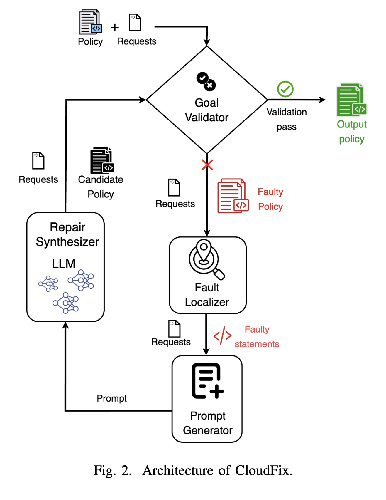

# CloudFix: Automated Policy Repair for Cloud Access Control

> **Official repository** for the paper:
> [**CloudFix: Automated Policy Repair for Cloud Access Control Policies Using Large Language Models**](https://arxiv.org/abs/2512.09957)
> Bethel Hall, Owen Ungaro, William Eiers — *Accepted at SANER 2026*

An LLM-based tool for automatically repairing faulty AWS IAM policies using SMT-based fault localization.

---

## Overview



*Figure: CloudFix pipeline — faulty policies are localized using SMT solving (Quacky/ABC), then iteratively repaired by an LLM until the full request suite passes validation.*

---

## Dataset

> We release the full dataset used in our experiments as part of this repository.

**282 real-world AWS IAM policies** collected from the AWS forums are available in:

```
clouldfix/data/original_policy/
```

Each policy is stored as a JSON file and represents a real access control configuration submitted by users seeking help. This dataset, along with the corresponding faulty variants and test request suites, constitutes a novel contribution for benchmarking automated policy repair tools.

| Directory | Contents |
|---|---|
| `clouldfix/data/original_policy/` | 282 original (ground-truth) AWS IAM policies |
| `clouldfix/data/faulty/` | Faulty variants used as repair inputs |
| `clouldfix/data/requests/` | Test request suites for validation |

---

## Prompt Design


---

## How It Works

1. **Fault Localization** — Uses SMT solving (via Quacky) to identify which statements in a faulty policy violate the test requests.
2. **LLM Repair** — Feeds the localized faults and original requirements to an LLM for iterative repair.
3. **Validation** — Validates the repaired policy against the full request suite until accuracy targets are met.
4. **Baseline Comparison** — A baseline mode repairs policies using only requirements (no fault localization) for comparison.

---

## validate_requests.py

`validate_requests.py` (located in `quacky/src/`) is the SMT-based validation engine that CloudFix uses to check whether a policy correctly allows or denies a set of test requests.

**What it does:**

1. Translates the policy into SMT-LIB constraints via Quacky's translator.
2. For each test request, asserts the action, resource, principal, and conditions into the formula and calls Z3. Satisfiable → `allow`; unsatisfiable → `deny`.
3. Compares the solver result against the expected effect and reports accuracy.
4. With `--identify-faulty`, performs statement-level fault localization:
   - **Case 1** — allowed but should be denied: finds which `Allow` statements match the request.
   - **Case 2a** — denied but should be allowed (explicit): finds which `Deny` statements block it.
   - **Case 2b** — denied but should be allowed (implicit): no matching `Allow` statement exists.
5. Saves an LLM-friendly fault report (`.txt`) and structured CSVs to `--output-dir`.

**Usage:**
```bash
# Run from quacky/src/
python validate_requests.py \
  -p1 <policy.json> \
  --requests <requests.json> \
  -s \
  [--identify-faulty --output <base_name> --output-dir <dir>]
```

| Flag | Description |
|---|---|
| `-p1` | Path to the policy JSON file |
| `--requests` | Path to the test requests JSON file |
| `-s` | Use SMT-LIB syntax (required) |
| `--identify-faulty` | Enable statement-level fault localization |
| `--output` | Base name for output files (default: `output`) |
| `--output-dir` / `-od` | Directory to save reports (default: `.`) |

---

## Getting Started

### Prerequisites

- Python 3.8+
- Linux or macOS
- Git, pip3, CMake, and a C++ compiler
- [Quacky](https://github.com/william-eiers/quacky) — SMT-based policy analyzer (see setup below)
- [ABC](https://github.com/vlab-cs-ucsb/ABC) — string constraint solver required by Quacky (see setup below)

---

### 1. Install ABC (String Constraint Solver)

ABC is required by Quacky for model counting over string constraints.

```bash
# Install build dependencies (Ubuntu/Debian)
sudo apt install git cmake g++ default-jdk

# Clone and build ABC
git clone https://github.com/vlab-cs-ucsb/ABC.git
cd ABC
# Follow INSTALL.md in the repo for platform-specific build steps
# After building, ensure the `abc` binary is on your PATH
```

> Alternatively, use the pre-built Docker image:
> ```bash
> docker pull vlabucsb/abc:ubuntu
> ```

---

### 2. Install Quacky (Policy Analyzer)

Quacky translates IAM policies into SMT constraints and uses ABC for validation.

```bash
# Install system dependencies
sudo apt install git python3-pip

# Clone Quacky into the project root
git clone https://github.com/william-eiers/quacky.git

# Install Python dependencies
cd quacky
sudo pip3 install -r requirements.txt
cd ..
```

Verify the installation:

```bash
cd quacky/src
python3 quacky.py -p1 ../samples/iam/exp_single/iam_simplest_policy/policy.json -b 100
```

You should see solve time, satisfiability status, and analysis metrics in the output.

---

### 3. Install CloudFix Dependencies

```bash
pip install pandas tqdm anthropic
```

### Running Policy Repair (with Fault Localization)

```bash
python clouldfix/code/fl_repair.py \
  --policies clouldfix/data/faulty \
  --requests clouldfix/data/requests \
  --output clouldfix/data/repaired
```

### Running Baseline (no Fault Localization)

```bash
python clouldfix/code/baseline.py \
  --policies clouldfix/data/faulty \
  --requests clouldfix/data/requests \
  --output clouldfix/data/repaired
```

### Generating Test Requests

Requests are generated per policy from `clouldfix/data/original_policy/`. Run from the `clouldfix/data/` directory:

```bash
cd clouldfix/data
python ../code/request_generate.py <policy_number> <num_requests> <misclassified_percent>
```

| Argument | Description |
|---|---|
| `policy_number` | Policy file index (reads `original_policy/{N}.json`) |
| `num_requests` | Total number of requests to generate |
| `misclassified_percent` | Percentage of requests with flipped expected effects (0–100) |

Output is saved to `requests/request-{num_requests}/{policy_number}.json`. The split is 60% allow / 40% deny, with each request containing exactly one action and one resource.

**Example** — generate 25 requests for policy 5, with 30% misclassified:
```bash
python ../code/request_generate.py 5 25 30
```

### Evaluating Results

```bash
python clouldfix/code/evaluate.py
```

---

## File Directory

```
fixmypolicy/
│
├── clouldfix/
│   ├── code/                        # Core source code
│   │   ├── fl_repair.py             # LLM repair with fault localization
│   │   ├── fl_localizer.py          # SMT-based fault localization logic
│   │   ├── baseline.py              # Baseline repair (no fault localization)
│   │   ├── evaluate.py              # Evaluation and scoring
│   │   ├── req_checker.py           # Request/policy requirement checker
│   │   ├── request_generate.py      # Test request generation
│   │   ├── request_augment.py       # Request augmentation utilities
│   │   ├── generalize.py            # Policy generalization helpers
│   │   ├── prompts.py               # LLM prompt templates
│   │   └── viz.ipynb                # Results visualization notebook
│   │
│   ├── data/                        # Datasets and artifacts
│   │   ├── faulty/                  # Faulty input policies (JSON)
│   │   ├── original_policy/         # Original ground-truth policies
│   │   ├── repaired/                # Repaired policy outputs
│   │   ├── requests/                # Test request suites
│   │   ├── intent/                  # Policy intent descriptions
│   │   ├── llm_gen_request/         # LLM-generated requests
│   │   └── prompt.jpg               # Prompt diagram
│   │
│   ├── script/                      # Standalone experiment scripts
│   │   ├── fl_repair.py
│   │   ├── baseline.py
│   │   └── request_generate.py
│   │
│   └── temp_validation/             # Intermediate validation results
│
└── quacky/                          # Quacky SMT policy analyzer (external)
```

---

## Environment Variables

| Variable          | Description                          | Default               |
|-------------------|--------------------------------------|-----------------------|
| `POLICY_DIR`      | Path to faulty policies              | `./data/faulty`       |
| `REQUESTS_DIR`    | Path to test requests                | `./data/requests`     |
| `OUTPUT_DIR`      | Path for repaired policy output      | `./data/repaired`     |
| `QUACKY_SRC_DIR`  | Path to Quacky source directory      | `./quacky`            |
