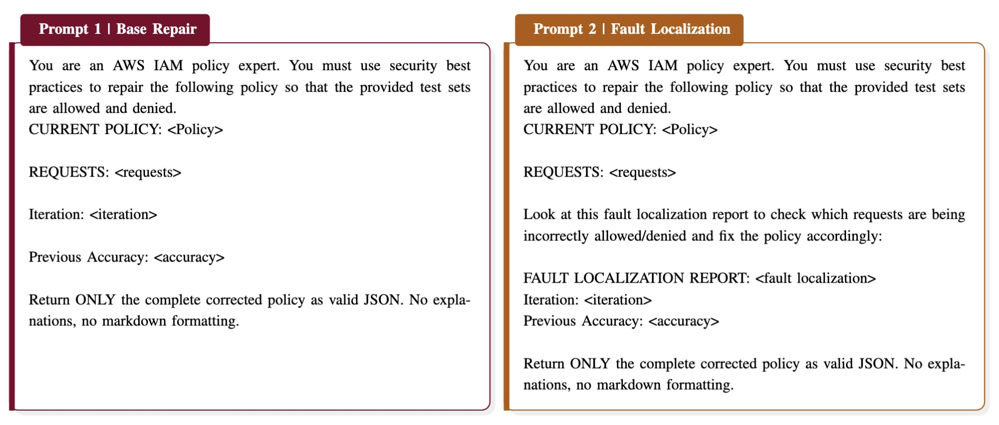

# CloudFix: Automated Policy Repair for Cloud Access Control

> **Official repository** for the paper:
> [**CloudFix: Automated Policy Repair for Cloud Access Control Policies Using Large Language Models**](https://arxiv.org/abs/2512.09957)
> Bethel Hall, Owen Ungaro, William Eiers — *Accepted at SANER 2026*

An LLM-based tool for automatically repairing faulty AWS IAM policies using SMT-based fault localization.



---

## How It Works

1. **Fault Localization** — Uses SMT solving (via Quacky) to identify which statements in a faulty policy violate the test requests.
2. **LLM Repair** — Feeds the localized faults and original requirements to an LLM for iterative repair.
3. **Validation** — Validates the repaired policy against the full request suite until accuracy targets are met.
4. **Baseline Comparison** — A baseline mode repairs policies using only requirements (no fault localization) for comparison.

---

## Getting Started

### Prerequisites

- Python 3.8+
- [Quacky](https://github.com/...) (SMT-based policy analyzer) — place source in `quacky/`
- Required Python packages:

```bash
pip install pandas tqdm anthropic
```

### Running Policy Repair (with Fault Localization)

```bash
python clouldfix/code/fl_repair.py \
  --policies clouldfix/data/faulty \
  --requests clouldfix/data/requests \
  --output clouldfix/data/repaired
```

### Running Baseline (no Fault Localization)

```bash
python clouldfix/code/baseline.py \
  --policies clouldfix/data/faulty \
  --requests clouldfix/data/requests \
  --output clouldfix/data/repaired
```

### Generating Test Requests

```bash
python clouldfix/code/request_generate.py
```

### Evaluating Results

```bash
python clouldfix/code/evaluate.py
```

---

## File Directory

```
fixmypolicy/
│
├── clouldfix/
│   ├── code/                        # Core source code
│   │   ├── fl_repair.py             # LLM repair with fault localization
│   │   ├── fl_localizer.py          # SMT-based fault localization logic
│   │   ├── baseline.py              # Baseline repair (no fault localization)
│   │   ├── evaluate.py              # Evaluation and scoring
│   │   ├── req_checker.py           # Request/policy requirement checker
│   │   ├── request_generate.py      # Test request generation
│   │   ├── request_augment.py       # Request augmentation utilities
│   │   ├── generalize.py            # Policy generalization helpers
│   │   ├── prompts.py               # LLM prompt templates
│   │   └── viz.ipynb                # Results visualization notebook
│   │
│   ├── data/                        # Datasets and artifacts
│   │   ├── faulty/                  # Faulty input policies (JSON)
│   │   ├── original_policy/         # Original ground-truth policies
│   │   ├── repaired/                # Repaired policy outputs
│   │   ├── requests/                # Test request suites
│   │   ├── intent/                  # Policy intent descriptions
│   │   ├── llm_gen_request/         # LLM-generated requests
│   │   └── prompt.jpg               # Prompt diagram
│   │
│   ├── script/                      # Standalone experiment scripts
│   │   ├── fl_repair.py
│   │   ├── baseline.py
│   │   └── request_generate.py
│   │
│   └── temp_validation/             # Intermediate validation results
│
└── quacky/                          # Quacky SMT policy analyzer (external)
```

---

## Environment Variables

| Variable          | Description                          | Default               |
|-------------------|--------------------------------------|-----------------------|
| `POLICY_DIR`      | Path to faulty policies              | `./data/faulty`       |
| `REQUESTS_DIR`    | Path to test requests                | `./data/requests`     |
| `OUTPUT_DIR`      | Path for repaired policy output      | `./data/repaired`     |
| `QUACKY_SRC_DIR`  | Path to Quacky source directory      | `./quacky`            |
